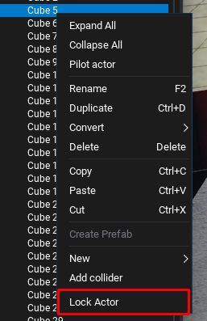
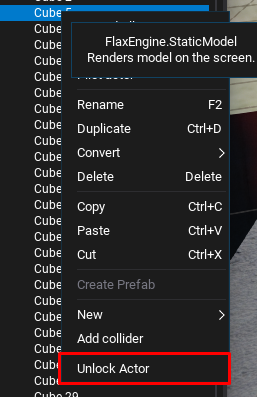
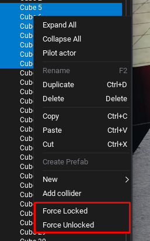

# HideNSeek
This is an editor plugin for the [Flax Game Engine](https://flaxengine.com) that allows you to lock/unlock actors.

About the name, i was going to add some other action to hide actors too, since Flax supports it, but i would also have to implement some other custom windows to show the hidden actors so you can show them again. I might do that in the future and then the name will make sense.

## Usage
Right-clicking on an actor in the scene tree will show one additional option for locking the actor if it's unlocked or unlocking if it's locked.

When selecting multiple actors, two options will be show, "Force Locked" and "Force Unlocked". These options do exactly that.

